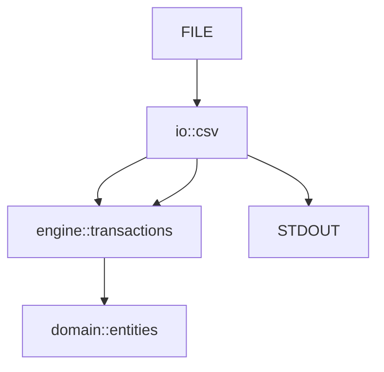
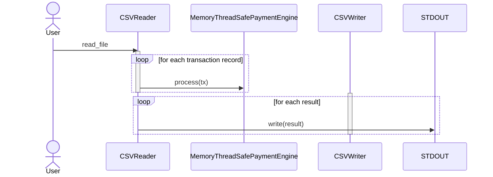
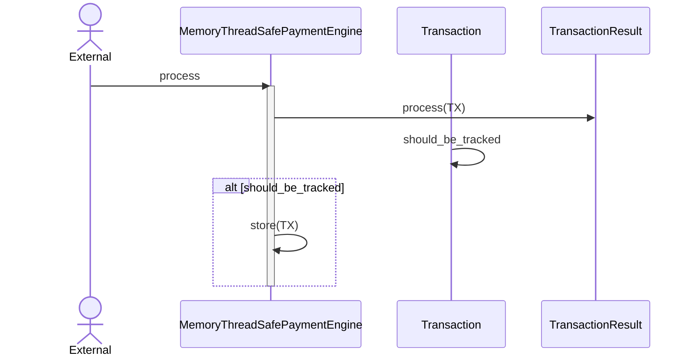

# Payment Settle Accounts

In this section, I will explore a minimalistic implementation of a Payment Engine. I will need to deal with multiple transactions and keep track of each User Account Balance.

## Table of Contents
- [Preliminaries](#preliminaries)
- [Building the Project](#building-the-project)
- [Running the Program](#running-the-program)
- [Design Documentation](#design-documentation)
- [Future Work](#future-work)
- [Conclusions](#conclusions)

---

## Preliminaries

There are 2 options for building this project:

1. You can build and run it directly with `Cargo`.
2. Alternatively, you can build and run it using `Docker`.

### Rust requirements

- You will need `cargo 1.72+`.
- Also, make sure you have `rustc 1.72+`.

### Docker requirements

- Ensure you have both the Docker Server and Client version 24+ installed.

## Building the Project

To build the project, run the following commands:

### Building with Rust

```shell
> cargo build
```

### Building with Docker

```shell
> docker build -t payments .
```

## Running the Program
The main program reads data from a **CSV** file and writes the results to **stdout**.

To test the program with a substantial **CSV** file, you will need to either generate one or have it available in your local environment. The examples under the `data` folder and `tests/data` folder are simple and do not represent real-world scenarios.

### Running with Rust

```shell
> cargo run -- my_path_to_my.csv > my_result.csv
```

### Running with Docker
When using **Docker**, you need to mount your local disk as a volume. If your **CSV** file is located at `/home/your_user/data/my_csv.csv`, follow these steps:

- Build the Docker image as explained in the Building with Docker section.
- Run the Docker image using the following command:

```shell
> docker run -v /home/your_user/data/my_csv.csv:/app/data payments /app/data/my_csv.csv
```

## Design Documentation
In this section, I will describe all the assumptions, decisions, and pending improvements that led to the current state of this software.

### Diagrams and Design

#### General Design



This high-level overview illustrates how different components interact within the system. The diagram comprises three main modules:

- `io::csv`: This module contains all the types responsible for interacting with the input FILE for reading the CSV and writing to the standard output. This module sends each record to the `engine::transactions` for processing and collects the results to send to STDOUT.
- `engine::transactions`: The engine processes each transaction sent by `io::csv` and interacts with the domain to keep track of changes, validating them as necessary.
- `domain::entities`: This module contains all the types used to represent `Transaction` and `TransactionResult`, facilitating the settling of user accounts.

#### Sequence Diagram
The following sequence diagrams outline the main flows of the system:

1. Main program



2. Process Transaction



### Assumptions
Here are some of the assumptions that were made during the development of this software:

- **Transaction IDs** are not globally unique. What makes a transaction unique is the combination of the **Transaction ID and Client ID**. It is assumed that **Transaction IDs** can be repeated among Clients. To accommodate this, the `MemoryThreadSafePaymentEngine` implementation includes special storage in memory to track transactions by Client.

- Although it would be ideal to split transactions into chunks and process them in different threads, for simplicity and to focus on the account settlement problem, this approach was not taken. However, the only implementation of `PaymentEngine` provided is thread-safe, allowing it to be used across multiple threads. There is a test within `engine::transactions` that verifies this behavior.

- It is assumed that the following errors would stop the program rather than continuing to process transactions, as these indicate incorrect sets of transactions that need verification:

    - **Insufficient Funds**: If a withdrawal is requested without sufficient balance.
    - **Inconsistencies in Balance**: This error may occur if, for example, there is a deposit of 10, followed by a withdrawal of 5, and then a dispute of the initial 10. This would result in an error because the deposit cannot be claimed. This assumption is made because it is not specified in the original problem.
    - Any parse error of the CSV.
    - Any other unexpected errors.
    - **Overflow in numbers** is not controlled, as we rely on the runtime system and compiler to handle this.

- No logging or observability mechanisms are implemented to simplify development and rely on testing.

###  Extensibility and Maintainability
The design supports extensibility and maintainability in the following ways:

- All processing is based on the `PaymentEngine` trait, allowing for future implementations with different semantics, such as using Kafka and a database for storage and messaging.
- The settlement logic is encapsulated within the `Transaction` type, making it the central place to modify or investigate any issues related to the software.
- Each module and important function has been thoroughly tested.

## Future Work
This exercise left many opportunities for improving the current solution that could be addressed in future implementations:

- Implement logging and observability.
- Implement partitioning and multithreading to process transactions concurrently in chunks.
- Introduce a Manager to extract the logic from main.rs, allowing for different combinations of sources -> engine -> destination.
- Implement different `PaymentEngine` implementations to reduce reliance on in-memory storage.

## Conclusions
Having worked on various highly distributed and transactional systems, it's fascinating how seemingly simple problems like these can still be challenging due to their sensitive nature. Despite this, it's remarkable how Rust facilitates the development of safe and secure solutions in a relatively short amount of time, with minimal external dependencies.

I thoroughly enjoyed working on this exercise, and I hope readers find it equally engaging. Your feedback and observations are welcome!
